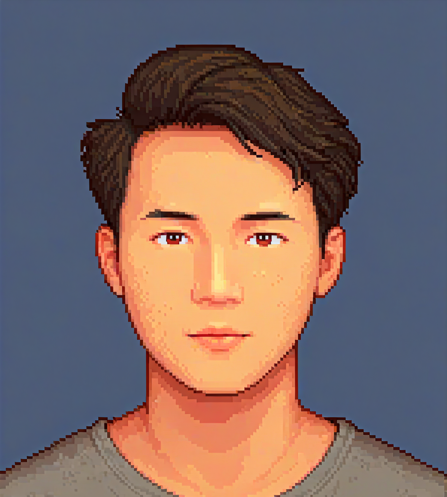
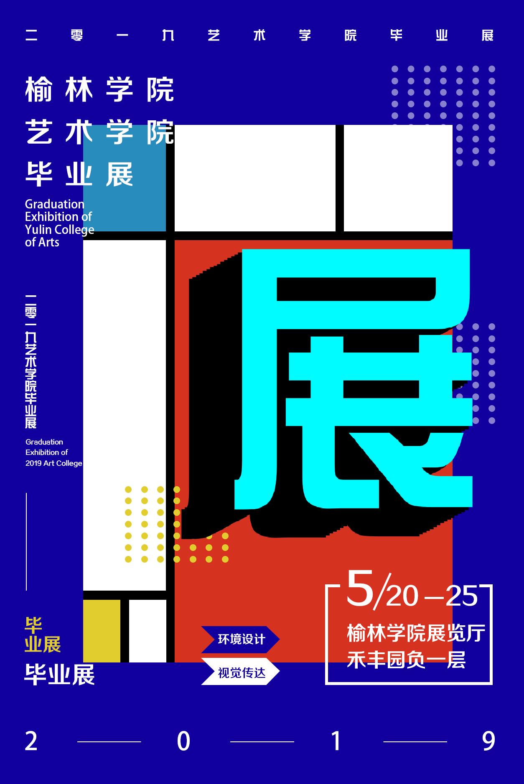
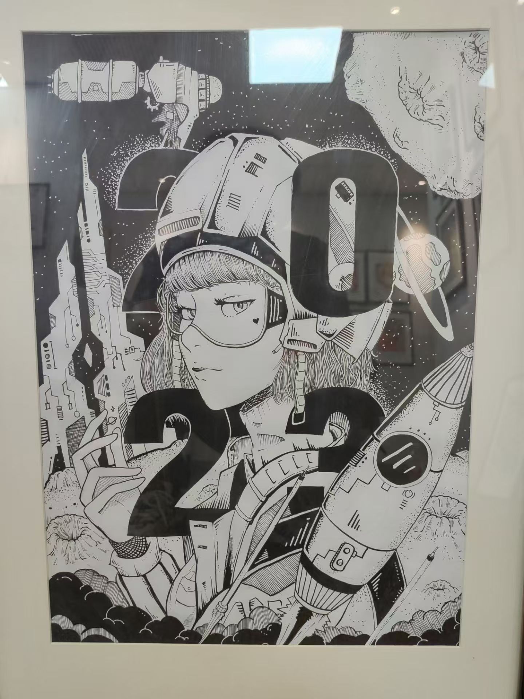
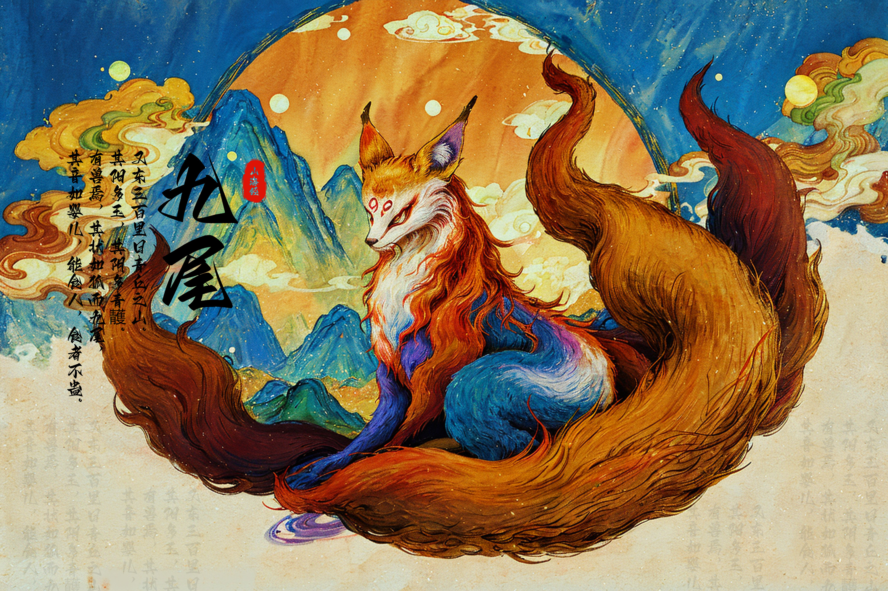
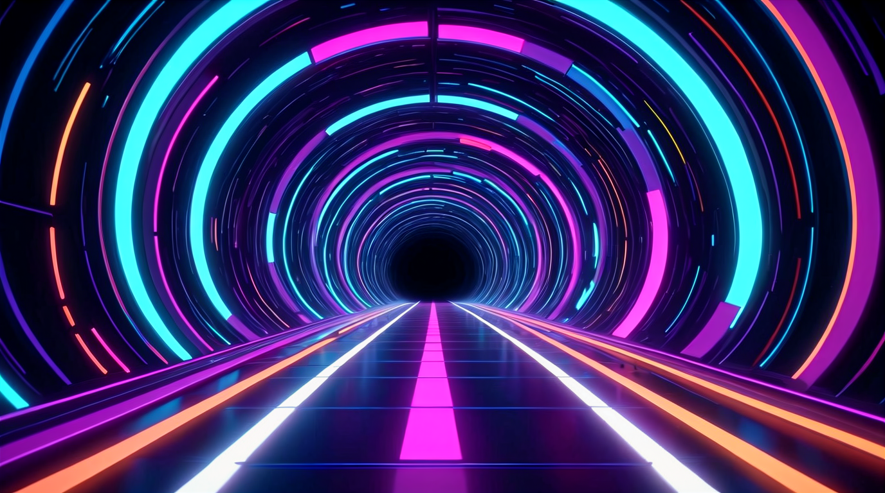
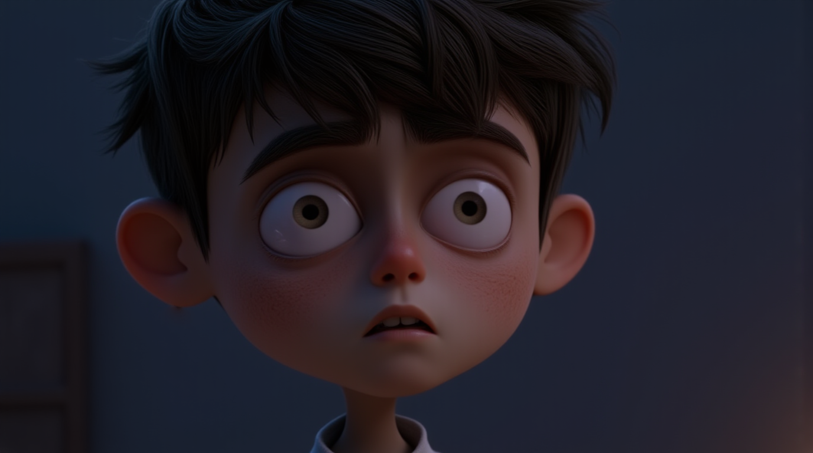

<!DOCTYPE html>
<html lang="zh">
<head>
    <meta charset="UTF-8">
    <meta name="viewport" content="width=device-width, initial-scale=1.0">
    <title>朱尚旺的作品集</title>
    
    
    
</head>
<body>
    <nav class="navbar">
        

            <a href="#home">主页</a>
            <a href="#about">关于我</a>
            <a href="#experience">经历</a>
            <a href="#skills">技能</a>
            <a href="#projects">作品集</a>
            <a href="#contact">联系</a>
        

    </nav>

    <section id="home" class="hero">
        

            
            <h1>朱尚旺</h1>
            
AI艺术创作者 / 设计师

            
专注于AI辅助艺术创作，擅长数字艺术与传统设计的融合

            <a href="./简历.jpg" class="download-resume" target="_blank">
                下载简历
            </a>
        

    </section>

    <section id="about" class="section fade-up">
        <h2 class="section-title">关于我</h2>
        

            我的艺术创作历程肇始于对人工智能的浓厚兴趣。在浙江师范大学攻读艺术设计硕士学位期间，
            我全身心投入到人工智能艺术创作领域的深入探究中，娴熟掌握了多种先进的工具与技术。
            我秉持将传统艺术与现代技术深度融合的理念，致力于创作出独具特色且富有创新性的艺术作品，
            为艺术领域的发展贡献力量。
        

    </section>

    <section id="experience" class="section fade-up">
        <h2 class="section-title">经历</h2>
        

            

                

                    2022 - 至今
                    <h3 class="text-xl font-bold">浙江师范大学</h3>
                    <h4 class="text-purple-400 mb-2">艺术设计硕士</h4>
                    
在此期间，本人专注于人工智能艺术创作方向的研究。积极参与多个 AI 艺术创作项目，深入探索不同 AI 工具的融合应用，致力于人工智能艺术领域的发展贡献自己的力量，在实践与研究中不断提升专业素养。

                

                

            

            

                

                    2021 - 2022
                    <h3 class="text-xl font-bold">独立艺术工作室</h3>
                    <h4 class="text-purple-400 mb-2">独立艺术家</h4>
                    
期间我专注于绘画学习，通过多种方式提升绘画与审美能力，并利用工作室资源探索 AI 辅助艺术创作。我临摹多种风格作品以提升绘画水平，通过多种途径提高审美，积极探索艺术创作新方向。

                

                

            

            

                

                    2017 - 2022
                    <h3 class="text-xl font-bold">本科学习</h3>
                    <h4 class="text-purple-400 mb-2">视觉传达设计专业</h4>
                    
在本科学习阶段，系统且全面地研习了设计理论与实践相关内容，对于艺术创作的完整流程以及相关软件的运用有着深入的了解和熟练的掌握，从而为后续的 AI 艺术创作奠定了坚实的基础。

                

                

            

        

    </section>

    <section id="skills" class="section fade-up">
        <h2 class="section-title">技能</h2>
        

            
                PS
                Adobe Photoshop - 专业的图像处理和设计软件
            
            
                AI
                Adobe Illustrator - 专业的矢量图形设计软件
            
            
                TD
                TouchDesigner - 实时视觉程和交互设计平台
            
            
                AE
                Adobe After Effects - 专业的视觉特效和动态图形软件
            
            
                PR
                Adobe Premiere - 专业的视频剪辑和编辑软件
            
            
                MAYA
                Autodesk Maya - 专业的3D建模和动画制作软件
            
            
                UE
                Unreal Engine - 强大的实时3D创作平台
            
            
                SD
                Stable Diffusion - 开源的AI图像生成模型
            
            
                MJ
                Midjourney - 先进的AI艺术创作工具
            
            
                Python
                通用编程语言，用于AI开发和自动化
            
            
                GPT-SoVITS
                开源的AI语音克隆和合成工具
            
        

    </section>

    <section id="projects" class="section">
        <h2 class="section-title">作品集</h2>
        

            

                

                    <h3>海报设计作品</h3>
                    
结合传统设计理念与现代审美，创作了一系列具有视觉冲击力的海报作品。涵盖商业广告、展览、社会议题等多个主题。

                    

                        展览海报
                        商业海报
                        Photoshop
                        Illustrator
                    

                

                
            

            

                

                    <h3>手绘艺术作品</h3>
                    
传统手绘与数字绘画相结合，展现独特的艺术风格。包括人物肖像、风景写生、概念设计等多种材料。

                    

                        数字绘画
                        插画设计
                        黑白装饰画
                        彩色手绘
                    

                

                
            

            

                

                    <h3>AI静态艺术作品</h3>
                    
用Stable Diffusion、Midjourney等AI工具，探索人工智能与艺术创作的边界，创作具有独特美学风格的静态作品。

                    

                        Stable Diffusion
                        Midjourney
                        DALL-E
                        AI艺术
                    

                

                
            

            

                

                    <h3>AI动态艺术作品</h3>
                    
结合AI与动态设计，创作富有生命力的动态艺术作品。包括动态海报、视觉效果、AI影像等多种形式。

                    

                        Animatediff
                        动态设计
                        Runway
                        视觉效果
                    

                

                
            

            

                

                    <h3>交互艺术装置</h3>
                    
结合AI技术与互动设计，打造沉浸式的艺术体验。通过声音、动作、触摸等多种方式与观众产生互动。

                    

                        互动设计
                        TouchDesigner
                        AI生成
                        手势交互
                    

                

                
            

        

    </section>

    <section id="contact" class="section fade-up">
        <h2 class="section-title">联系方式</h2>
        

            

                <i class="contact-icon">
                    <svg xmlns="http://www.w3.org/2000/svg" width="24" height="24" viewBox="0 0 24 24" fill="none" stroke="currentColor" stroke-width="2" stroke-linecap="round" stroke-linejoin="round">
                        <path d="M12 4c4.4 0 8 3.6 8 8s-3.6 8-8 8-8-3.6-8-8 3.6-8 8-8z"/>
                        <path d="M15 16l3 3"/>
                    </svg>
                </i>
                357527685
            

            

                <i class="contact-icon">
                    <svg xmlns="http://www.w3.org/2000/svg" width="24" height="24" viewBox="0 0 24 24" fill="none" stroke="currentColor" stroke-width="2" stroke-linecap="round" stroke-linejoin="round">
                        <path d="M22 16.92v3a2 2 0 0 1-2.18 2 19.79 19.79 0 0 1-8.63-3.07 19.5 19.5 0 0 1-6-6 19.79 19.79 0 0 1-3.07-8.67A2 2 0 0 1 4.11 2h3a2 2 0 0 1 2 1.72 12.84 12.84 0 0 0 .7 2.81 2 2 0 0 1-.45 2.11L8.09 9.91a16 16 0 0 0 6 6l1.27-1.27a2 2 0 0 1 2.11-.45 12.84 12.84 0 0 0 2.81.7A2 2 0 0 1 22 16.92z"/>
                    </svg>
                </i>
                15270606566
            

            

                <i class="contact-icon">
                    <svg xmlns="http://www.w3.org/2000/svg" width="24" height="24" viewBox="0 0 24 24" fill="none" stroke="currentColor" stroke-width="2" stroke-linecap="round" stroke-linejoin="round">
                        <path d="M4 4h16c1.1 0 2 .9 2 2v12c0 1.1-.9 2-2 2H4c-1.1 0-2-.9-2-2V6c0-1.1.9-2 2-2z"/>
                        <polyline points="22,6 12,13 2,6"/>
                    </svg>
                </i>
                zsw357527685@163.com
            

        

    </section>

    <footer>
        
© 2024 朱尚旺. 保留所有权利。

    </footer>

    

        <button class="modal-close" onclick="closeModal()">×</button>
        

            

                
&lt;

            

            

                
&gt;

            

            

                <!-- 内容将通过 JavaScript 动态添加 -->
            

            

                

                    

                

            

        

    

    

        

            <button class="preview-close" onclick="closePreview()">×</button>
            
        

    

    
</body>
</html> 
